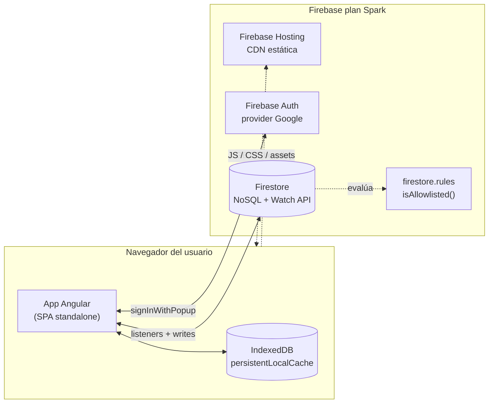
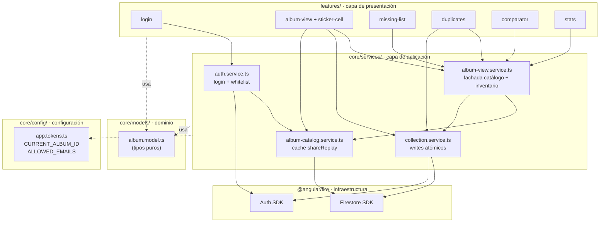
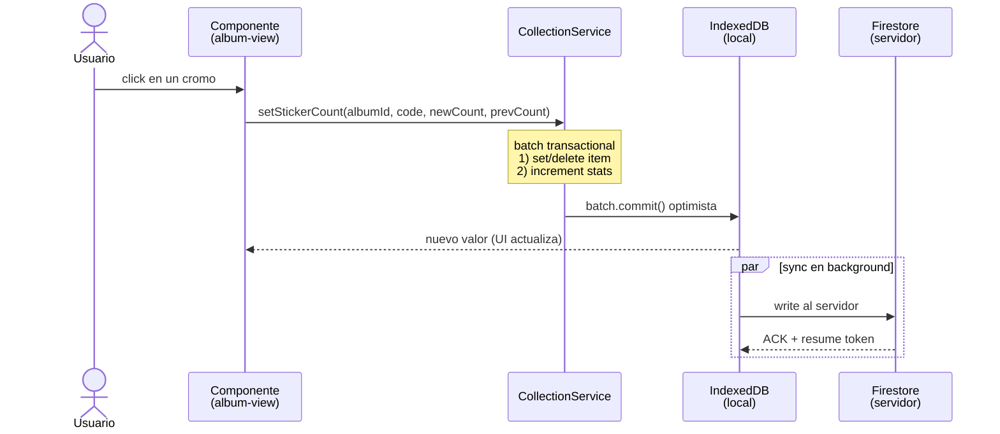

# Copa Tracker — Álbum WC 2026

[](https://github.com/JostinAlvaradoS/album-tracker-wc2026/actions/workflows/ci.yml)
[](#cobertura-de-tests)
[](LICENSE)
[](CHANGELOG.md)
[](https://angular.dev)
[](https://firebase.google.com)
[](https://www.conventionalcommits.org)

Aplicación web para llevar la cuenta de los cromos del álbum del Mundial 2026.
Marca lo que ya tienes pegado, registra repetidos para intercambio y consulta
estados de cromos en segundos durante un cambio.

> **Identidad propia.** Este proyecto no usa marcas, logos, mascotas ni
> tipografías oficiales de FIFA o Panini. La estética es original.

**Stack:** Angular 18 (standalone + signals) · Firestore + Firebase Auth · SCSS.

## Features

- **Álbum** — grid completo con tres estados por cromo: pegado / falta / repe.
  Click izquierdo alterna pegado, click derecho suma una repetida.
- **Faltas** — lista agrupada por selección, copiable para compartir.
- **Repes** — gestión de repetidos con +/−, lista copiable para organizar
  intercambios.
- **Comparador** — input rápido para consultar el estado de un cromo durante
  un intercambio. Muestra si te falta, si ya lo tienes o cuántas copias tienes
  para cambiar.
- **Stats** — progreso global y por selección, con anillo de progreso.
- **Whitelist opcional** — limita el acceso a cuentas de Google específicas.
  Si no la configuras, cualquier cuenta de Google puede entrar.

## Capturas

### Vista principal

<p align="center">
  
</p>

### Otras pantallas

<table>
<tr>
<td width="33%" align="center"></td>
<td width="33%" align="center"></td>
<td width="33%" align="center"></td>
</tr>
</table>

### Estados de un cromo

<table>
<tr>
<td width="33%" align="center"><br/><sub><b>Pegado</b> · ya lo tienes en el álbum</sub></td>
<td width="33%" align="center"> <br/><sub><b>Falta</b> · aún no aparece</sub></td>
<td width="33%" align="center"><br/><sub><b>Repe</b> · disponible para cambio</sub></td>
</tr>
</table>

## Setup

### Requisitos

- Node 20+ (ver `.nvmrc`)
- npm o pnpm
- Una cuenta de Firebase (plan Spark gratuito alcanza para uso personal)

### 1. Clonar e instalar

```bash
git clone <tu-fork>.git copa-tracker
cd copa-tracker
cd scripts && npm install && cd ..
cd angular && npm install
```

### 2. Configurar Firebase

1. Crea un proyecto en https://console.firebase.google.com.
2. Habilita **Firestore Database** (modo producción).
3. Habilita **Authentication → Sign-in method → Google**.
4. Desde **Project settings → Your apps** copia los valores del SDK Web.

### 3. Configurar variables de entorno

```bash
cd angular
cp .env.example .env
# Edita .env y rellena los valores de Firebase
```

Variables disponibles:

| Variable | Obligatorio | Default |
|---|---|---|
| `NG_APP_FIREBASE_*` (6 vars) | Sí | — |
| `NG_APP_ALBUM_ID` | No | `wc2026` |
| `NG_APP_ALLOWED_EMAILS` | No | (vacío = modo abierto) |

`set-env.js` genera `angular/src/environments/environment.ts` automáticamente
antes de cada `npm start` / `npm run build`. El `.env` está en `.gitignore`.

### 4. Importar el catálogo

`scripts/catalog.json` ya viene en el repo (994 cromos del Mundial 2026, ~232KB).
Solo lo subes a tu Firestore.

Necesitas una clave de servicio para que el script tenga permisos:

1. Firebase Console → **Project settings → Service accounts → Generate new private key**.
2. Guarda el JSON como `scripts/serviceAccountKey.json` (en `.gitignore`).

```bash
cd scripts
npm install                       # solo la primera vez
node import-to-firestore.js       # sube los 994 cromos
```

> **¿Quieres modificar el catálogo?** Edita `scripts/generate-catalog.js`
> (es la fuente de verdad de la estructura) y corre `node generate-catalog.js`
> para regenerar `catalog.json` antes del import.

### 5. Configurar la whitelist de acceso

> **Importante:** la whitelist vive en **dos archivos que tienes que mantener
> idénticos a mano**. Es la parte más manual del setup y suele confundir.
> Lee con calma este apartado antes de deployar.

#### Por qué hay dos lugares

La whitelist se valida en dos capas independientes:

| Capa | Archivo | Rol |
|---|---|---|
| **Cliente** (UX) | `angular/.env` → `NG_APP_ALLOWED_EMAILS` | Cuando alguien hace login, el cliente verifica el email **antes** de tocar Firestore. Si no coincide, hace `signOut` y muestra el mensaje "La cuenta X no está autorizada". Sin esto, el usuario logra autenticarse y ve la UI cargando sin contenido (Firestore le responde `permission-denied` en silencio). |
| **Servidor** (autoridad real) | `firestore.rules` → función `isAllowlisted()` | Es la **única autoridad de seguridad**. Corre en infraestructura de Google y bloquea cualquier lectura/escritura que no pase. Aunque alguien modifique el JS del cliente con DevTools, las reglas no se pueden bypasear. |

Firebase no tiene forma nativa de leer variables de entorno desde
`firestore.rules`, ni de importar archivos TypeScript. Por eso la lista
hay que escribirla **manualmente en los dos archivos**.

#### Los dos modos de operación

**Modo A — Whitelist activa (recomendado para uso personal/familiar)**

`angular/.env`:
```
NG_APP_ALLOWED_EMAILS=tu@gmail.com,amigo1@gmail.com
```

`firestore.rules` (función `isAllowlisted`):
```
function isAllowlisted() {
  return request.auth != null
    && request.auth.token.email_verified == true
    && request.auth.token.email in [
      'tu@gmail.com',
      'amigo1@gmail.com'
    ];
}
```

Solo esas cuentas pueden entrar y operar.

**Modo B — Abierto (cualquier cuenta de Google entra)**

Útil para demos públicas, hackatones o forks donde quieres que cualquiera
pruebe la app y juegue con su propia colección aislada.

`angular/.env`:
```
NG_APP_ALLOWED_EMAILS=
```
(vacío, o directamente no agregues la línea)

`firestore.rules` (función `isAllowlisted`):
```
function isAllowlisted() {
  return request.auth != null
    && request.auth.token.email_verified == true;
}
```

Cualquier Google account entra. Las otras reglas siguen aislando los
datos por `uid` — cada usuario solo ve su propia colección.

#### Qué pasa si los dos archivos no coinciden

| Cliente (`.env`) | Servidor (`rules`) | Resultado |
|---|---|---|
| Sin lista (vacío) | Sin lista (modo abierto) | ✅ Funciona. Modo abierto coherente. |
| Lista con tu email | Misma lista | ✅ Funciona. Modo restringido coherente. |
| Lista con tu email | Sin lista | ⚠️ El cliente bloquea emails ajenos, pero alguien con DevTools puede bypasearlo. **No es seguro.** |
| Sin lista | Lista con tu email | ❌ UX rota. Cualquiera puede iniciar sesión desde el cliente, pero al intentar leer/escribir Firestore recibe `permission-denied` sin contexto. |

**Regla práctica:** después de cambiar la whitelist, deploya las reglas:

```bash
firebase deploy --only firestore:rules
```

Sin este deploy, el cambio queda solo en tu máquina y no protege nada.

#### Sobre versionar tu email en `firestore.rules`

Por ahora el email del operador queda escrito en `firestore.rules`
(que sí está versionado en el repo). Un email no es un secret, pero
si te incomoda exponerlo en un repo público, la alternativa es mover
la whitelist a una colección Firestore (`allowlist/{email}` gestionada
desde Firebase Console). Lo discutimos en
[ADR-0003](docs/adr/0003-whitelist-dual-client-rules.md) como
"opción D"; sigue siendo una migración válida cuando el operador
quiera o cuando la lista crezca a más de unas pocas personas.

### 6. Ejecutar en local

```bash
cd angular
npm start                         # http://localhost:4200
```

### Scripts disponibles

```bash
npm start            # dev server con HMR
npm run build        # build de producción
npm run lint         # ESLint + angular-eslint
npm test             # tests con Jest
npm run test:watch   # tests en modo watch
npm run test:ci      # tests con coverage (formato CI)
```

CI corre `lint + test + build` en cada push y pull request. Ver
[`.github/workflows/ci.yml`](.github/workflows/ci.yml).

### Cobertura de tests

**116 tests · ~88% statements global** (corte vigente impuesto por
`jest.config.js`):

| Capa | Threshold | Estado |
|---|---|---|
| Global | 85% | ✓ |
| `core/services/` (dominio) | 90% | ✓ |
| `core/guards/` | 100% | ✓ |
| `core/config/` | 100% | ✓ |

Si una PR baja la cobertura de estos umbrales, CI rompe. Los archivos de
bootstrap (`app.config.ts`, `app.routes.ts`, `main.ts`, `environment.ts`)
están excluidos del cálculo — no tienen lógica testeable como unidad.

### 7. Deploy

```bash
cd angular && npm run build && cd ..
firebase login                    # si no estás logueado
firebase use <tu-project-id>
firebase deploy --only firestore:rules,hosting
```

## Estructura del catálogo

| Sección | Cromos | Códigos |
|---|---|---|
| Intro / oficiales | 9 | `00`, `FWC1`–`FWC8` |
| Selecciones (48 × 20) | 960 | `MEX1`–`MEX20`, `ARG1`–`ARG20`, etc. |
| Campeones | 11 | `FWC9`–`FWC19` |
| Coca-Cola | 14 | `CC1`–`CC14` |
| **Total** | **994** | |

Estructura editable en `scripts/generate-catalog.js`.

## Modelo de datos en Firestore

```
albums/{albumId}                            (doc del álbum, estático)
albums/{albumId}/sections/{id}              (51 secciones)
albums/{albumId}/stickers/{code}            (994 docs, ID = código)

users/{uid}/collections/{albumId}           (stats denormalizadas)
users/{uid}/collections/{albumId}/items/{code}
                                            (1 doc SOLO por cromo poseído)
```

**Diseño:** un cromo sin doc en `items/` = no se tiene. Evita crear ~1000
documentos vacíos al iniciar un álbum.

## Arquitectura

> Los diagramas usan [Mermaid](https://mermaid.js.org/), que GitHub
> renderiza de forma nativa. Si los ves como bloques de código, abre
> el README desde GitHub web (no desde un editor local sin plugin).

### 1. Vista de sistema

Qué corre en el navegador, qué en Firebase y por dónde se hablan.



**Cómo leerlo:**

- El **bundle Angular** se sirve estático desde Firebase Hosting.
- La app abre **listeners reactivos** contra Firestore. La librería
  guarda copia local de cada doc en **IndexedDB**, así un refresh o
  cierre de pestaña no implica volver a descargar el catálogo (ver
  [ADR-0001](docs/adr/0001-firestore-caching-strategy.md)).
- Cada operación de Firestore se valida contra `firestore.rules`. La
  función `isAllowlisted()` chequea el email del token (whitelist).
- El login es client-side con popup de Google; el cliente verifica
  además que el email esté en `ALLOWED_EMAILS` y hace `signOut` si no
  (ver [ADR-0003](docs/adr/0003-whitelist-dual-client-rules.md)).

### 2. Capas internas de la app Angular

Cómo se organizan los módulos dentro de `angular/src/app/`.



**Reglas que se respetan:**

- Los **componentes nunca tocan Firestore directo**: pasan por servicios.
- `AlbumViewService` actúa como **fachada**: combina catálogo + inventario
  reactivamente, los componentes leen una sola fuente.
- Los **tipos del dominio** (`album.model.ts`) son puros — no dependen
  de Firestore. Si mañana migráramos a otro backend, esta capa no se
  toca.
- Los **InjectionTokens** (`app.tokens.ts`) hacen configurable lo que
  antes era magic string (`'wc2026'`) o lista hardcoded (whitelist).

### 3. Flujo de un click ("marcar pegado" / "sumar repe")

Por qué cada click siente que es instantáneo aunque exista un servidor.



**Por qué importa este flujo:**

- El **UI se actualiza con el primer frame** porque el batch se aplica
  al cache local antes del round-trip. Sin esto, cada click tendría
  300-800 ms de delay perceptible.
- El caller pasa `prevCount` desde un listener que ya tiene el valor.
  Esto elimina un `getDoc()` previo. Resultado:
  **0 reads + 1 write por click** en vez de 2 reads + 1 write.
- Si la red está caída, el write queda **encolado en IndexedDB** y se
  manda al recuperar conexión. La app sigue usable offline.

### 4. Estructura de carpetas

```
angular/src/app/
  app.config.ts                  Bootstrap, providers, InjectionTokens
  app.routes.ts                  Rutas standalone + authGuard
  core/
    config/app.tokens.ts         CURRENT_ALBUM_ID, ALLOWED_EMAILS
    models/album.model.ts        Tipos puros del dominio
    services/
      auth.service.ts            Login Google + whitelist + UnauthorizedEmailError
      album-catalog.service.ts   Lee catálogo, cacheado por shareReplay
      collection.service.ts      Inventario del usuario (writes atómicos)
      album-view.service.ts      Fachada: combina catálogo + inventario
    guards/auth.guard.ts         authGuard
  features/
    login/                       Pantalla de login con whitelist check
    album-view/                  Grid principal
      sticker-cell/              Sub-componente presentacional
    missing-list/                Lista de faltas
    duplicates/                  Gestión de repes
    comparator/                  Consulta rápida para intercambios
    stats/                       Resumen y progreso
```

Más detalle de la estrategia de caching (IndexedDB persistente, shareReplay,
0 reads antes de writes) en `CLAUDE.md`.

### Decisiones arquitectónicas (ADRs)

Las decisiones técnicas relevantes están documentadas en formato
[MADR 3.0](https://adr.github.io/madr/) bajo [`docs/adr/`](docs/adr/):

- [ADR-0001 — Estrategia de caching de Firestore](docs/adr/0001-firestore-caching-strategy.md)
- [ADR-0002 — Un documento por cromo poseído](docs/adr/0002-single-doc-per-owned-sticker.md)
- [ADR-0003 — Whitelist dual (cliente + reglas)](docs/adr/0003-whitelist-dual-client-rules.md)
- [ADR-0004 — Stack: Firebase + Angular vs alternativas](docs/adr/0004-stack-firebase-angular.md)

## Contribuir

PRs bienvenidos. Antes de abrir uno, lee:

- [CONTRIBUTING.md](CONTRIBUTING.md) — flujo, estilo, convenciones de commits.
- [CODE_OF_CONDUCT.md](CODE_OF_CONDUCT.md) — Contributor Covenant 2.1.
- [SECURITY.md](SECURITY.md) — cómo reportar vulnerabilidades (en privado).
- [CHANGELOG.md](CHANGELOG.md) — historial de versiones.

Cada PR pasa por CI (`lint + test + build`) y se valida contra los
thresholds de cobertura definidos en `jest.config.js`.

## Personalización

- **Nombres de jugadores reales:** salen como "Jugador 1, 2…". Edita
  `scripts/generate-catalog.js` y regenera el catálogo.
- **Otros álbumes:** cambia `NG_APP_ALBUM_ID` en `.env` y genera un catálogo
  con el nuevo id.

## Limitaciones conocidas

- Solo soporta autenticación con Google (Anonymous fue removido por la
  whitelist).
- La whitelist en cliente es UX: la seguridad real la imponen las reglas
  de Firestore. Mantener ambas en sync.
- El bundle inicial está sobre los 512KB (warning de Angular CLI); razonable
  para una app Firebase con AngularFire.

## Licencia

[MIT](LICENSE) © 2026 Jostin Alvarado
